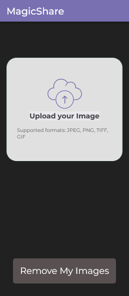
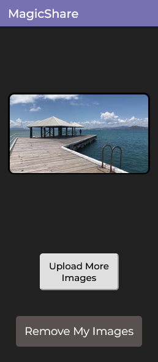

# MagicShare - Team HelloWorld
For project 041, Proxiemic Displays.


## Motivation

The product MagicShare is designed to be a platform for users to seamlessly and spontaneously share images with each other via a large interactive display. These iterations are described to be proxiemic because they are effected by the users physical lactation in relation to the large display. In other words, users are permitted to connect to the display and share images from their device if they are close to the display. The user's images will remove themselves from the display if they walk too far away from the screen. Sending images to the screen is designed to be as frictionless as possible, requiring no authentication obstacles.

## When would I use MagicShare?

MagicShare is perfect for large groups of people where showing content on a small device would be impractical.
With traditional content hosting services, there is one "presenter" who controls all of the content being displayed. With MagicShare, the system is decentralised, allowing all users the opportunity to excess themselves.


## How do I use MagicShare


1. Ensure you are connected to the correct network. MagicShare can be set up on any network owned by the installer but by default the network is called ``HELLOWORLD``

2. Scan the barcode displayed on the screen. You will be directed to our web application.

3. Upload images using the web application. You can select any from your devices file explorer. When you want to remove your images, simply walk away, disconnect form the network or click, "Remove my Images".

 

## Demo of the Project


## Installation

#### Prequisites
Before, installation, you must have the following programs already installed. Unfortunately, the server only runs on Linux, but users can access from any platform.

* Python3+
* NodeJS
* Linux

#### How to install

1. Clone the git into your local machine
``` 
git clone https://github.com/DECO3801-HelloWorld/studio-build.git
```

2. Execute the run shell script.
```
./scripts/run.sh [PORT]
```
Note: You <strong>must </strong> execute `run.sh` from the root directory `./studio-build`. It will not work otherwise.

You can also optionally specify your desired port number for the web application. If left blank, the program defaults to port `3001`. You may need to modify your firewall rules to allow connections from this port.

3. The program will ask 
```
Start in dev mode? (Auto-Updating) [y/n]
```
Type `n` and press enter

4. After the script has run, the display application should open on your default browser. If it doesn't open automatically, navigate to 
```
http://{YOUR MACHINE IP ADRESS}:{YOUR PORT NUMBER}/display
```
The terminal should print out your machine IP for convenience.


It is worth noting that any device on the network can show the display if directed to the given IP address. This is useful to note if you have a dedicated machine for showing the display.

The terminal screen also prints various actions that have been performed such as users uploading photos, connecting and disconnecting.

## Security, Ethical & Privacy Considerations
Security of the connection between the client device and the hub is handled by standard Wi-Fi security protocols. We have decided to use nothing weaker than WPA2, as is the standard for non-enterprise organisations.  
It is assumed that all users only post images to the screen that they are comfortable sharing with other people in the room. It is policy to never write these images to disk. This means that when the user disconnects the images will be permanantly removed from memory and there is no risk of future users seeing their images.  
Proximity is a consideration to ensure that the user can see everyone that can access the screen. This gives the user confidence that they're only sharing their images with people they trust them with. 

## Codebase References And Citations

``src/display-manager/src/Components/ImgPod.css:39``
[Border With Gradient and Radius](https://dev.to/afif/border-with-gradient-and-radius-387f)

https://dev.to/afif/border-with-gradient-and-radius-387f

---
``src/display-manager/src/Components/Encoder.jsx``
[base64ArrayBuffer.js](https://gist.github.com/jonleighton/958841)

https://gist.github.com/jonleighton/958841

---
``src/display-manager/index.css``
[Montserrat Font](https://fonts.googleapis.com/css2?family=Montserrat:wght@400;500;700;900&display=swap)

https://fonts.googleapis.com/css2?family=Montserrat:wght@400;500;700;900&display=swap

## Team Members

All the people working on this project:
* Benjamin Jorgensen
* Tadiwa Mlambo
* Shristi Gupta
* Suryansh Singh
* Kristian Norved
* Lauchie Harvey
