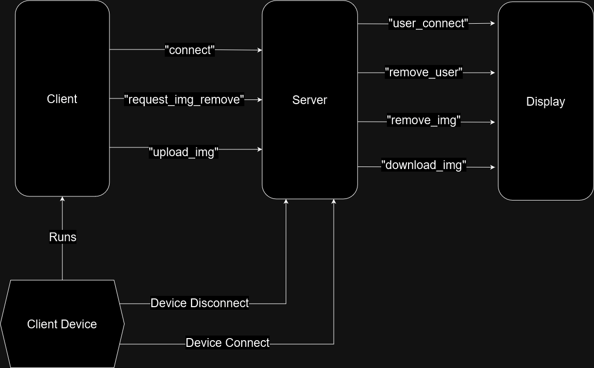

# Team HelloWorld!
The codebase for Project 041 as implemented by Team HelloWorld.

## Networking



Here is a list for the network calls for the entire system. If the arrow is leading from the box, then it's an emit event. Otherwise it's a socket.on() event.

## "connect"
This is reserved event for when sockets connect to the server.
For the server, listen to this and log result.

## "request_img_remove"
For client:

    When user wants to remove an image from the display, emit a packet of the form:
    ```
    const imgPacket = {
        userIP: {socket.handshake.address},
        imgId: {Unique id for the image being sent | Int}
    }
    ```
For Sever:

Listen to the "request_img_remove" event on the socket. When received create a packet of the form:
    ```
    const imgPacket = {
        imgId: {userIP + client-imgId}
    }
    ```
and emit on event "remove_img"

## "upload_img"
For client:

    When user wants to send an image to the display, emit the packet
    ```
    const imgPacket = {
        userIP: {socket.handshake.adress}
        imgId: {image ID}
        imgName: file.name
        imgPayload: file,
        imgType: file.type
    }
    ```
For Sever:

Listen to the "upload_img" event on the socket. Verify the validity of the filetype.  Create a packet of the form:
```
const imgPacket = {
    userId: userId \\integer associated with IP adress
    imgId: {IP + image ID}
    imgName: file.name
    imgPayload: file,
    imgType: file.type
}
```
and emit on "download_img" event

## "user_connect"
For server:

Emit this event when there is a new IP connection to the network. It is important to note the distinction between network and client. Use the package
```
const data = {
    userId: userId
}
```

For display manager:

Add The user-icon / token to the display

## "remove_user"
For server:

Emit this event when there an IP connection is disconnected from the network. It is important to note the distinction between network and client. Use the package
```
const data = {
    userId: userId
}
```

For display manager:

Remove the user icon and remove all images from the userId.

## "remove_img"
For Sever:

Listen to the "request_img_remove" event on the socket. When received create a packet of the form:
    ```
    const imgPacket = {
        imgId: {userIP + client-imgId}
    }
    ```
and emit on event "remove_img"

For display manager:

Remove the image corresponding to the imgId.

## "download_img"
For Sever:

Listen to the "upload_img" event on the socket. Verify the validity of the filetype.  Create a packet of the form:
```
const imgPacket = {
    userId: userId \\integer associated with IP adress
    imgId: {IP + image ID}
    imgName: file.name
    imgPayload: file,
    imgType: file.type
}
```
and emit on "download_img" event

For display manager:

Render the image to the display

## Device connect
On a new IP connection to the network, the server should emit the event "user_connect" with the payload
```
const data = {
    userId: {userId}
}
```

### Display-Manager
Display manager features:
* Use sockets API to upload images to it (Remind me to write up documentation for this)
* Backspace to clear images from screen
* Slashscreen for when system idle

TODO:
* Image Positioning system
* Fancier animations
* Splashscreen idle animation
* Setup Script for testing

## Please note that aesthetics are messed up at the moment. Will fix css in future


## Team Members
All the people working on this project:
* Benjamin Jorgensen
* Tadiwa Mlambo
* Shristi Gupta
* Suryansh Singh
* Kristian Norved
* Lauchie Harvey

